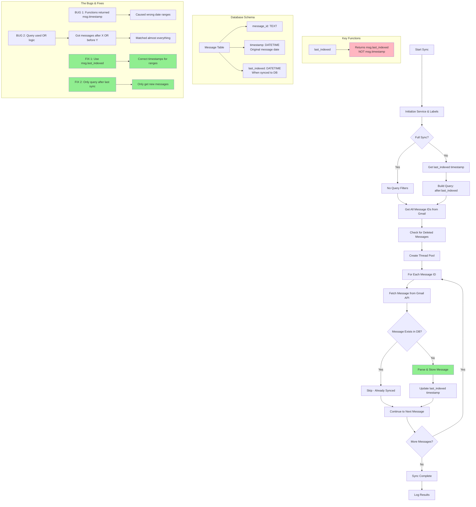

# Gmail-to-SQLite Sync Flow

## Sync Process Explanation

1. **Initialization**: Create Gmail service and fetch labels
2. **Query Building**:
   - For incremental sync: Use `last_indexed()` and `first_indexed()` to create date range
   - For full sync: No date filters
3. **Message Collection**: Get all message IDs matching the query from Gmail
4. **Deletion Detection**: Compare Gmail IDs with DB IDs to mark deleted messages
5. **Parallel Processing**: Use thread pool to fetch and process messages
6. **Storage**: Parse and store new messages, skip existing ones

## The Bugs That Were Fixed

**Bug 1: Wrong Timestamp Source**

- `last_indexed()` and `first_indexed()` returned `msg.timestamp` (original message date) instead of `msg.last_indexed` (sync date)
- Caused incorrect date ranges in Gmail queries

**Bug 2: OR Logic in Query**

- Gmail query used `" | ".join(query)` creating `after:X | before:Y` (OR logic)
- This matched messages "after recent date OR before old date" = almost everything
- Caused full re-sync every time

## The Solution

**Fix 1:** Changed functions to return `msg.last_indexed`
**Fix 2:** Removed `first_indexed()` and OR logic - only query `after:last_indexed`

Result: Incremental sync now only fetches truly new messages!
